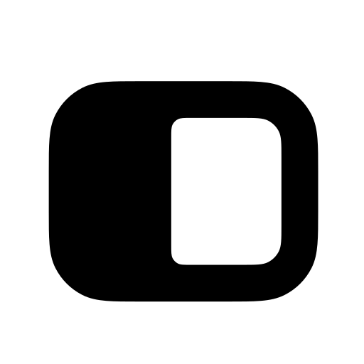
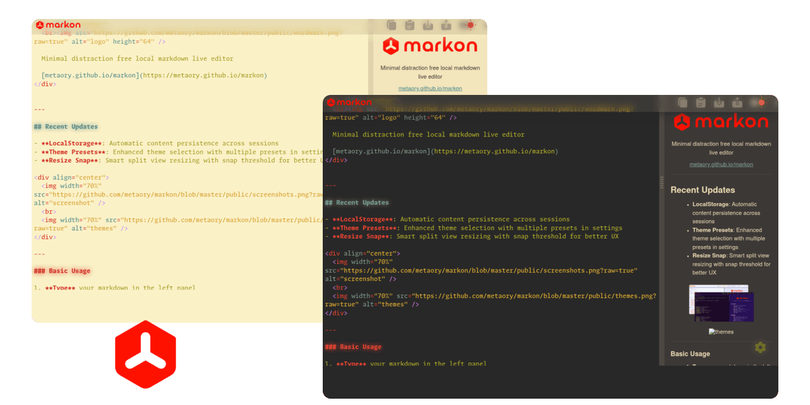
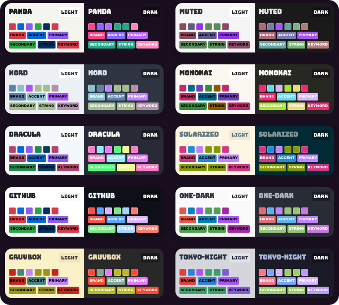

<div align="center">
  <h1>
    
  </h1>
  <strong>
    Minimal distraction-free live Markdown editor
  </strong>
  <br>
  <br>
  
  <br>
  <br>
  <a href="https://getmarkon.com">
    
  </a>
  <h3>
    <a href="https://getmarkon.com">getmarkon.com</a>
  </h3>
</div>
<hr>
<div align="center">
  <a href="#development">Development</a> • <a href="#themes">Themes</a> • <a href="#roadmap">Roadmap</a>
	
</div>

## Features

- **GFM**: GitHub Flavored Markdown + alerts
- **Syntax**: 250+ languages with highlighting
- **Split views**: resizable editor & preview
- **Sync views**: bidirectional scroll sync
- **Auto save**: localStorage persistence
- **FPS profiler**: latency metrics overlay
- **Spell checker**: toggleable browser spellcheck
- **Themes**: multiple presets
- **Hotkeys**: keyboard shortcuts
- **Offline**: no network required

## Language Loading & Caching

**markon** uses **lazy loading** for syntax highlighting to keep the app fast and lightweight:

- **On-demand loading**: Language modules are only loaded when you use them
- **Smart caching**: Once loaded, languages work offline in future sessions
- **250+ languages**: Full highlight.js support with minimal initial bundle size
- **PWA optimized**: Cached languages persist across app updates

> [!TIP]
> **Offline behavior**: Languages you've used before will work offline. New languages require an internet connection to load initially.

---

## Development

```bash
npm run dev      # start dev server
npm run build    # build for production
npm run check    # lint code
npm run fix      # fix lint issues
```

<details>
<summary id="themes">Themes</summary>



**markon** supports multiple theme presets with dark/light modes. Custom themes can be created using CSS variables.

### Preview Themes

Visit `/themes` to preview all available themes side-by-side in both dark and light modes. This helps you choose the perfect theme before applying it in settings.

### Color Preview

The theme selection dialog shows 4 preview colors for each theme:

- `--brand`: Primary brand color (buttons, highlights)
- `--accent`: Accent color (links, interactive elements)
- `--primary`: Primary UI color
- `--secondary`: Secondary UI color

### CSS Variables

Themes are defined using CSS custom properties. All available variables:

**Base colors:**

- `--bg`: Background color
- `--bg-light`: Light background (panels, cards)
- `--text`: Text color

**Main colors:**

- `--brand`: Brand/primary action color
- `--accent`: Accent/interactive color
- `--primary`: Primary UI color
- `--secondary`: Secondary UI color

**Syntax highlighting:**

- `--comment`: Code comments
- `--meta`: Metadata/imports
- `--operator`: Operators
- `--keyword`: Keywords
- `--regex`: Regular expressions
- `--property`: Object properties
- `--string`: Strings
- `--literal`: Literals/numbers
- `--hint`: Hints/tooltips

**Status colors:**

- `--success`: Success indicators
- `--warning`: Warning indicators
- `--info`: Info indicators
- `--error`: Error indicators

### Creating Custom Themes

Define themes in `src/themes.css` using this structure:

```css
html[data-theme="panda"][data-mode="dark"] {
  --bg: #1a0f1f;
  --bg-light: #2d1a2d;
  --text: #f0f0e8;
  --brand: #ff1100;
  --accent: #8866ff;
  --primary: #bb66ff;
  --secondary: #22aa88;
  --comment: #bbbbbb;
  --meta: #ff1100;
  --operator: #bb88ee;
  --keyword: #ff88bb;
  --regex: #ff99cc;
  --property: #4488ff;
  --string: #22aa88;
  --literal: #ffbb66;
  --hint: #8866dd;

  --success: #22bb11;
  --warning: #ffaa00;
  --info: #1199cc;
  --error: #ff1100;
}

html[data-theme="panda"][data-mode="light"] {
  --bg: #f5f5f0;
  --bg-light: #ffffff;
  --text: #1a1a1a;
  --brand: #d73a49;
  --accent: #0366d6;
  --primary: #8b5cf6;
  --secondary: #28a745;
  --comment: #6a737d;
  --meta: #6f42c1;
  --operator: #0366d6;
  --keyword: #d73a49;
  --regex: #e36209;
  --property: #0366d6;
  --string: #032f62;
  --literal: #6f42c1;
  --hint: #28a745;

  --success: #22bb11;
  --warning: #ffaa00;
  --info: #1199cc;
  --error: #cc6600;
}
```

Themes are automatically detected and appear in the settings dialog. Both `dark` and `light` modes should be defined for each theme.

</details>

---

## Roadmap

- [ ] **VIMODE**: codemirror-vim
- [x] **Autosave**: local persistence
- [ ] **Export**: PDF/HTML
- [x] **Mobile**: touch gestures
- [x] **PWA**: installable, offline cache
- [x] **Scroll**: toggle scroll follow
- [ ] **Share**: ~~url hash content~~
- [x] **Snap**: split resize snapping
- [x] **Shortcuts**: command palette
- [x] **Theming**: custom CSS look
- [x] **Theme Presets**: multiple presets in settings

> [!NOTE]
> _in no particular order_

<a href="https://metaory.github.io/markon">metaory.github.io/markon</a>

---

## License

[AGPL-3.0](LICENSE)
